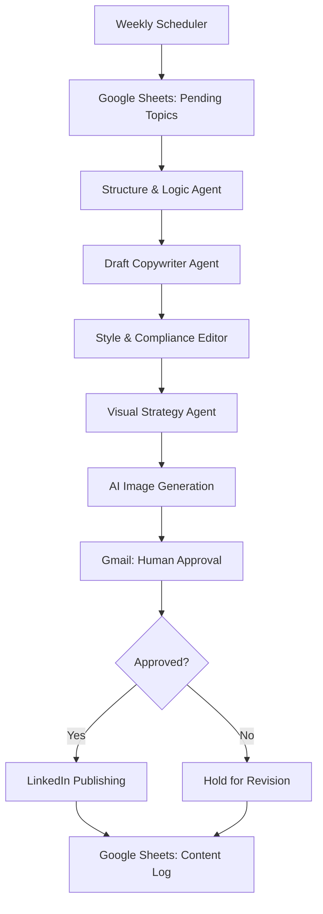

# LinkedIn Content Automation Agent

An AI-powered multi-agent workflow that automates the end-to-end LinkedIn content creation and publishing lifecycle — from topic selection and content structuring to drafting, visual generation, human approval, and scheduled publishing.

Built using **n8n and LLM-powered agents**, the system transforms a manual content creation process into a structured, repeatable, and reviewable workflow.

Rather than relying on a single LLM to generate and publish content, the system uses specialized agents with distinct responsibilities, sequential handoffs, and a human-in-the-loop approval mechanism to maintain content quality and control.

---

## Overview

Creating consistent, high-quality LinkedIn content involves several repetitive tasks: identifying topics, structuring ideas, writing drafts, maintaining a consistent voice, generating visuals, and managing publishing schedules.

This project addresses that workflow through a multi-agent architecture where each agent handles a specific stage of content production.

### Key Objectives

* Automate repetitive content creation tasks.
* Maintain consistency in content structure and tone.
* Separate content generation from quality review.
* Generate visual concepts and supporting images.
* Retain human oversight before publishing.
* Track content history and publishing status.

---

## Architecture

### Agent Responsibilities

| Agent                     | Responsibility                                                                                                         |
| ------------------------- | ---------------------------------------------------------------------------------------------------------------------- |
| Structure & Logic Agent   | Converts a raw topic into a structured content blueprint with a clear narrative, logical flow, and key talking points. |
| Draft Copywriter Agent    | Transforms the blueprint into a complete LinkedIn post.                                                                |
| Style & Compliance Editor | Reviews the draft for tone, clarity, consistency, and content quality before it moves forward.                         |
| Visual Strategy Agent     | Develops a visual direction and generates image prompts aligned with the post's message.                               |
| Human Approval Layer      | Gives the content owner final control over what gets published.                                                        |

Each agent operates as a specialized component within the larger n8n workflow, reducing the need for a single model to manage every responsibility.

---

## Workflow

### 1. Topic Selection

A weekly scheduler triggers the workflow and retrieves pending topics from Google Sheets.

### 2. Content Structuring

The Structure & Logic Agent creates a blueprint defining the post's narrative, key points, and logical progression.

### 3. Draft Generation

The Copywriter Agent uses the blueprint to produce the initial LinkedIn post.

### 4. Quality Review

The Style & Compliance Editor evaluates the draft and refines it for readability, tone, and consistency.

### 5. Visual Generation

The Visual Strategy Agent determines an appropriate visual direction and generates an image prompt. The prompt is passed to an image-generation service to produce supporting creative assets.

### 6. Human-in-the-Loop Approval

The completed post and its visual are sent through Gmail for review.

The system incorporates a 48-hour approval wait, allowing the content owner to review the material before it proceeds to publishing.

**The key design principle: automation handles execution, but the final publishing decision remains with a human.**

### 7. Publishing and Logging

Approved content is published to LinkedIn, and the workflow records the outcome in Google Sheets.

The content log captures:

* Topic
* Generated content
* Publication date
* Publishing status
* Content difficulty
* Image link

This creates a centralized record of the content production lifecycle.

---

## Tech Stack

| Technology                   | Purpose                                                    |
| ---------------------------- | ---------------------------------------------------------- |
| n8n                          | Workflow orchestration, agent coordination, and automation |
| Large Language Models (LLMs) | Content generation, structuring, and review                |
| Google Sheets                | Topic management and publishing logs                       |
| Gmail                        | Human approval and notifications                           |
| LinkedIn API / Integration   | Content publishing                                         |
| Image Generation API         | Visual asset creation                                      |

---

## Key Engineering Concepts

### Multi-Agent Orchestration

The workflow distributes responsibilities across specialized agents instead of depending on one general-purpose LLM call.

### Structured Outputs

Agent responses follow defined output structures, making it easier to pass information between workflow stages and maintain predictable handoffs.

### Sequential Agent Handoffs

Each stage consumes the previous stage's output, creating a traceable content production pipeline.

### Human-in-the-Loop (HITL)

The approval mechanism prevents autonomous publishing from becoming an unchecked process and keeps a human involved in the final decision.

### Workflow Automation

Scheduling, data retrieval, notifications, publishing, and logging are coordinated through n8n.

### Modular Design

Individual agents can be modified or extended without requiring a complete redesign of the workflow.

---

## Potential Extensions

* Add automated content scoring and evaluation.
* Introduce feedback-driven revisions based on approval outcomes.
* Implement retry handling and failure notifications.
* Add performance analytics using LinkedIn engagement data.
* Introduce content memory to reduce repetitive topics.
* Support multiple content formats and publishing channels.
* Add observability for agent outputs, execution status, and failure points.

---

## Project Context

This project was developed as part of hands-on work with agentic AI systems and workflow automation.

It explores how LLM-powered agents can be combined with traditional automation tools to build practical systems that go beyond isolated prompt execution.

The project also served as a foundation for understanding agent orchestration, structured outputs, workflow design, and human oversight in AI-driven applications.

---

**Built with:** n8n · LLMs · Google Sheets · Gmail · LinkedIn Integration · Image Generation API
